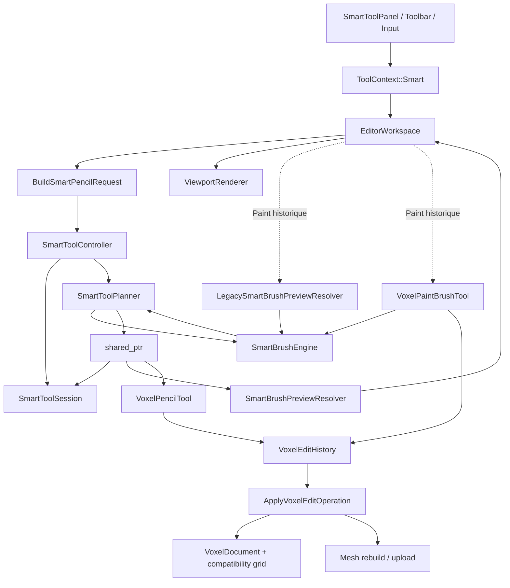

# AR-0101 — Smart Tool Architecture Review

| Champ | Valeur |
|---|---|
| Projet | VoxelForge Studio |
| Audit | AR-01 |
| Référence | `VF-0300-Smart-Tool-Architecture.md` |
| Révision inspectée | `e01b10047a818b2dd28d65c3934e1d6bf83fc7a6` |
| Branche | `feature/imgui` |
| Date | 2026-07-26 |
| Nature | Audit d'architecture, sans changement fonctionnel |

## 1. Résumé exécutif

SMART-01 et SMART-02 ont établi une vraie frontière de domaine :

- `SmartToolController` coordonne le cache et la session ;
- `SmartToolPlanner` est l'unique producteur de `SmartToolPlan` pour Add et
  Erase ;
- `SmartToolPlan` est exposé par `shared_ptr<const ...>` ;
- le Preview Add/Erase et le Commit Pencil consomment la même instance ;
- le Commit refuse un plan absent, obsolète ou destiné à un autre document ;
- aucune dépendance ImGui, SDL, D3D12, viewport ou renderer n'entre dans le
  domaine Smart Tool.

Cette fondation est saine, mais elle n'est pas encore le contrat V1 complet
décrit par VF-0300. Le plan ne porte ni valeur `Before`, ni valeur `After`, et
la requête ne sait lire que l'occupation booléenne d'une cellule. Elle ne peut
donc pas exprimer correctement Paint, Replace ou un Undo entièrement dérivé du
plan. Paint reste effectivement sur un second chemin historique.

La faiblesse principale n'est pas un mauvais découpage UI/renderer. Elle est
le contrat de cellule trop pauvre entre Planner, Preview, Commit et Undo. Il
doit être durci avant SMART-03 afin de ne pas multiplier les adaptations par
action.

## 2. Périmètre et méthode

Ont été inspectés :

- VF-0300 dans son intégralité ;
- les fichiers `SmartToolController`, `SmartToolSession`,
  `SmartToolPlanner`, `SmartToolPlan`, `SmartToolRequest`,
  `SmartToolResult` et `SmartToolExecutionContext` ;
- `SmartBrushEngine`, `SmartBrushPreviewResolver` et le resolver Legacy ;
- `VoxelPencilTool`, `VoxelPaintBrushTool`, `VoxelEditHistory`,
  `VoxelEditOperation` et `VoxelEditTransaction` ;
- les raccordements dans `EditorWorkspace` ;
- `BrushProfileService`, sa persistance et ses tests ;
- les tests SMART-01/SMART-02 et Pencil.

L'audit a combiné :

1. lecture statique des dépendances et des contrats ;
2. recherche de tous les chemins de Preview et Commit ;
3. vérification de l'ownership et de l'immutabilité ;
4. sonde temporaire Debug des allocations, copies et temps ;
5. configuration, compilation, CTest complet et smokes.

La sonde temporaire a été placée sous `build/`, hors Git. Aucun code produit
n'a été modifié.

## 3. Diagramme réel des dépendances



### 3.1 Sens des dépendances

Le sens de dépendance du nouveau domaine est correct :

```text
UI/Input
  -> EditorWorkspace
  -> Controller
  -> Session + Planner
  -> Plan
  -> Preview/Execution
```

Constats :

- aucune dépendance inversée vers ImGui, SDL, D3D12, viewport ou renderer ;
- aucune boucle d'include ou d'ownership détectée ;
- le renderer ne calcule aucune géométrie Smart Tool ;
- `SmartToolPlan` ne contient aucun pointeur vers le document ;
- `EditorWorkspace` reste cependant l'orchestrateur réel du Preview et du
  Commit : le Controller ne lance pas les consommateurs annoncés par
  `SmartToolExecutionContext`.

### 3.2 Inversion de dépendances incomplète

Le domaine dépend directement du moteur concret :

- `SmartTool.h` inclut `SmartBrushEngine.h` ;
- `SmartToolRequest` contient un `SmartBrushRequest` ;
- `SmartToolResult` expose un `SmartBrushResultCode` ;
- `SmartToolPlanner` appelle directement `SmartBrushEngine::Resolve`.

Ce choix est acceptable pour la migration Pencil, mais il ne constitue pas
encore le système de stratégies prévu par VF-0300. Face, Line, Rectangle, Fill,
plugins ou IA exigeraient soit des branches supplémentaires dans le Planner,
soit l'introduction tardive de résolveurs internes. Il faut créer ces ports
avant que plusieurs modes n'arrivent.

## 4. Audit de SmartToolPlan

### 4.1 Immutabilité

L'immutabilité externe est réelle :

- constructeur privé ;
- seul `SmartToolPlanner` est ami ;
- collections exposées uniquement par références constantes ;
- type partagé `std::shared_ptr<const SmartToolPlan>` ;
- aucune API de mutation après construction.

La durée de vie est claire : Controller, Session, Preview et Commit partagent
la même allocation. Le test de fondation vérifie l'identité de pointeur entre
Preview et Commit.

### 4.2 Ownership

Le plan possède par valeur :

- géométrie et action ;
- état Brush ;
- UUID du profil ;
- placement ;
- `SmartBrushResult` complet ;
- clé de cache ;
- identifiants ;
- cellules résolues ;
- diagnostics.

Il ne conserve ni la `std::function` d'occupation de la requête, ni une
référence, ni un span, ni un pointeur interne. Une mutation ultérieure de la
requête ou du profil ne change pas le plan.

### 4.3 Autonomie

**Réponse : Partiellement.**

Le plan est autonome pour :

- la géométrie Add/Erase ;
- la position et la palette de destination Add ;
- l'état visuel de chaque cellule ;
- la vérification de la clé document/révision ;
- le Preview exact Add/Erase.

Il n'est pas autonome pour produire l'opération historique complète :

- une cellule ne contient pas `ExistedBefore`/`ExistsAfter` ;
- elle ne contient pas la palette précédente ;
- Erase relit le document au Commit afin de construire l'état `Before` ;
- Paint et Replace ne sont pas représentables ;
- Pick ne possède pas de résultat de contexte ;
- le plan ne porte pas de label/metadata de transaction générique.

Le Commit ne recalcule pas la géométrie, mais il complète encore la vérité
métier nécessaire à Undo. `SmartToolPlan` ne peut donc pas encore être
l'unique vérité de toute la V1.

### 4.4 Données dupliquées

Pour une cellule valide Add, la position peut être conservée simultanément
dans :

- `SmartBrushResult::Positions` ;
- `SmartBrushResult::AddablePositions` ou `ExistingPositions` ;
- `SmartToolPlan::Cells`.

Les quatre vecteurs de `SmartBrushResult` réservent chacun la capacité du
volume résolu, même lorsque certains restent vides. À 4 096 cellules, le plan
occupe environ 328 293 octets hors metadata d'allocateur, soit environ
80 octets par cellule. Le détail est dans AR-0103.

### 4.5 Identifiants

`PlanId` et `Revision` reçoivent aujourd'hui la même valeur issue d'un compteur
local au Planner. Cette « révision » n'est pas la révision du document, laquelle
est dans la clé. Les noms sont ambigus et le compteur n'est ni stable entre
processus, ni thread-safe. C'est suffisant pour le cache V1 synchrone, pas pour
macros sérialisées, plugins asynchrones ou collaboration.

## 5. Audit de SmartToolRequest

### 5.1 Champs actuels

| Champ | Évaluation |
|---|---|
| `Geometry` | nécessaire conceptuellement, mais le type mélange mode et shape |
| `Action` | nécessaire, mais l'enum contient des valeurs non canoniques VF-0300 |
| `BrushRequest` | utile à la migration, trop couplé au moteur concret |
| `SourceIdentity` | garde process-local utile, non portable |
| `SourceRevision` | indispensable |
| `SourceGeneration` | indispensable |
| `SourceSubModelIndex` | indispensable |
| `ActiveProfileUuid` | provenance utile, mais ne devrait pas invalider seul une géométrie identique |
| `Workplane` | stocké par la Session, ignoré par le Planner et absent de la clé |

### 5.2 Champs à supprimer ou déplacer

- `Workplane` sous sa forme actuelle : il duplique un placement déjà résolu et
  le Planner ne le lit jamais. Il faut soit le retirer de la requête, soit le
  remplacer par un vrai snapshot de plan de construction lorsque les modes en
  auront besoin.
- `ActiveProfileUuid` ne devrait pas être un composant géométrique de cache.
  Il peut rester provenance du plan, avec une révision de réglages séparée.
- `SmartBrushRequest::IsOccupied` ne doit pas survivre comme contrat V1 :
  c'est une callback vers un document mutable, impossible à sérialiser et
  incapable de retourner la palette précédente.

### 5.3 Champs nécessaires de SMART-03 à SMART-10

Les prochains lots demanderont probablement :

- lecture de cellule `optional<palette>` ou snapshot sparse, pas seulement
  `bool occupied` ;
- `SmartMode` canonique séparé de `SmartGeometry` et de `SmartBrushShape` ;
- source et destination Replace ;
- hit complet, face, normale et identifiant de surface ;
- ancres et points ordonnés d'un geste ;
- phase du geste et modificateurs ;
- axes et origine du Workplane ;
- snapshot Scene/Selection optionnel ;
- politiques de snap, overwrite, limites et connectivité ;
- seed déterministe ;
- version des réglages et des algorithmes ;
- identifiant de geste/session ;
- capacité/budget/annulation pour Face et Fill ;
- identifiant stable de document pour replay, macro ou réseau ;
- identifiant/version du resolver pour plugins.

## 6. Audit du Planner

### 6.1 Autorité actuelle

Pour Add et Erase, le Planner est bien :

- l'unique appelant de `SmartBrushEngine` dans le nouveau pipeline ;
- l'unique normalisateur action -> mode Brush ;
- l'unique constructeur de `SmartToolPlan` ;
- l'unique créateur des cellules Add/Erase/Ignore/Clipped.

Le Preview ne recalcule rien et le Commit ne calcule aucune position.

### 6.2 Calculs hors Planner

#### Critique

- Paint calcule encore géométrie, occupation et cellules modifiables dans
  `VoxelPaintBrushTool` et `LegacySmartBrushPreviewResolver`.
- La valeur précédente d'Erase est résolue au Commit, car elle n'existe pas
  dans le plan.

#### Important

- `EditorWorkspace::BuildSmartPencilRequest` choisit l'ancrage hit/adjacent/
  Workplane, la normale, la couleur active et les conditions d'action. Cette
  traduction d'interaction est acceptable dans une couche applicative, mais
  elle est aujourd'hui dans la classe la plus couplée de l'éditeur plutôt que
  dans le Controller ou un builder de contexte.
- `BuildCells` recrée deux ensembles hashés à partir de vecteurs déjà classés
  par `SmartBrushEngine`.
- `SmartToolCellOperation` ne connaît que Add, Erase et Ignore.

#### Acceptable pendant la migration

- les anciens services Box, Line, Sphere, Fill et Eraser restent parallèles,
  car leurs lots de migration ne sont pas commencés ;
- `SmartBrushEngine` demeure le resolver concret Pencil/Cube/Sphere ;
- la vérification document/grille au Commit est une garde d'intégrité, pas un
  second calcul géométrique.

## 7. Audit du Preview

Pour Add/Erase :

- même instance de plan que le Commit ;
- aucune lecture Brush Profile après planification ;
- aucun appel à `SmartBrushEngine` ;
- aucune lecture du document ;
- conversion déterministe cellule -> Ghost ;
- aucune divergence de positions observée.

Limites :

- `SmartBrushPreviewResolver::Resolve` alloue de nouveaux vecteurs à chaque
  appel, même lors d'un cache hit ;
- `EditorWorkspace` recopie ensuite les positions dans
  `VoxelPlacementPreview` ;
- `activePaletteColor` est actuellement ignorée dans le nouveau resolver ;
- Paint utilise le resolver Legacy et relit le document ;
- `VoxelPreviewData` et le contrat Smart Brush ne sont pas encore unifiés.

Les mesures Debug donnent cinq allocations par adaptation Preview et environ
48 octets temporaires par cellule avant les copies supplémentaires du
Workspace.

## 8. Audit du Commit

`VoxelPencilTool::Apply` :

- exige un plan ;
- vérifie identité, génération, révision et sous-modèle ;
- refuse toute action autre qu'Add/Erase ;
- ne rappelle ni Planner ni Brush Engine ;
- transforme toutes les cellules en un seul `VoxelEditOperation` ;
- exécute une seule transaction et un seul rebuild ;
- effectue des contrôles de synchronisation document/grille avant et après.

Deux écarts restent :

1. Erase relit la palette précédente pour compléter `VoxelChange`.
2. Si `History == nullptr`, un chemin direct `ApplyVoxelChanges` existe. Il
   est utile aux tests/compatibilités, mais l'architecture V1 devrait imposer
   l'historique en production ou rendre le bypass explicitement test-only.

Le Commit est donc géométriquement fidèle, mais pas encore un adaptateur
générique plan -> historique.

## 9. Undo / Redo

**L'Undo ne peut pas encore fonctionner uniquement à partir du plan.**

Il manque :

- existence avant/après ;
- palette avant/après ;
- action canonique par cellule ;
- metadata de transaction ;
- éventuelle transition de contexte pour Pick ;
- source Replace.

L'historique actuel est en revanche compatible avec un plan V2 : une cellule
résolue contenant `Before` et `After` se convertit directement en
`VoxelDocumentChange`. Undo/Redo n'a pas besoin d'être remplacé.

## 10. Brush Profiles

### 10.1 Propriétés confirmées

- service sans dépendance ImGui, renderer, viewport ou document ;
- UUID stable ;
- format JSON versionné ;
- lecture/écriture atomique avec récupération de transaction ;
- validation stricte ;
- favoris et récents ;
- champs inconnus tolérés ;
- application explicite dans `SmartTool` ;
- aucune conservation de hit, document, plan ou sélection.

Le plan snapshotte l'UUID, le BrushState et la palette résolue. Une modification
du profil après planification ne change pas le plan.

### 10.2 Indépendance

**Réponse : Partiellement.**

Le stockage CRUD est indépendant du Planner. Le schéma dépend néanmoins
directement des enums et de `SmartTool`, et ne couvre pas encore Mode, source
Replace, options Face/Line/Fill, politiques ou versions d'algorithmes.

Brush Profiles peut évoluer pour ses metadata sans toucher au Planner. Toute
nouvelle valeur affectant le résultat doit naturellement entrer dans les
settings/request/cache du Planner. Cela n'est pas une dépendance au service,
mais exige un contrat de settings canonique absent aujourd'hui.

## 11. Préparation à SMART-03

**Réponse : Non, pas sans un durcissement ciblé préalable.**

Add et Erase sont prêts. Paint, Replace et Pick ne peuvent pas être ajoutés
proprement avec `SmartToolPlanCell` actuel :

- Paint et Replace exigent la palette précédente ;
- Replace exige une règle source ;
- Pick ne produit pas de mutation voxel ;
- le booléen `IsOccupied` ne fournit pas assez d'information ;
- la duplication `SmartAction`/`SmartBrushMode` favorise de nouveaux chemins.

La correction minimale n'est pas une refonte générale :

1. introduire une opération de cellule `Before/After` explicite avec flags ;
2. remplacer la requête booléenne par une lecture de cellule en valeur ;
3. invalider le plan lorsque l'état de Session qui influence la clé change ;
4. créer un adaptateur générique plan -> `VoxelEditOperation` ;
5. migrer Paint dans ce chemin avant d'ajouter Replace/Pick.

Ce durcissement ciblé est officiellement nommé **SMART-02.5 — Plan Contract
Hardening**. Il ne remet en cause ni SMART-01 ni SMART-02.

## 12. Questions obligatoires

### L'architecture est-elle suffisamment découplée ?

**Partiellement.** Elle est découplée de l'UI et du renderer, mais le domaine
est encore couplé au `SmartBrushEngine` concret et à ses codes/résultats.

### Existe-t-il encore plusieurs chemins métier ?

**Oui.** Add/Erase utilisent Planner/Plan ; Paint utilise encore
`VoxelPaintBrushTool` et `LegacySmartBrushPreviewResolver`. Les anciens outils
Box/Line/Sphere/Fill/Eraser restent des chemins de compatibilité.

### SmartToolPlan peut-il devenir l'unique vérité ?

**Oui, après enrichissement.** Son ownership et son immutabilité conviennent.
Il lui manque les valeurs avant/après, les actions canoniques et des metadata
de contexte.

### L'Undo peut-il fonctionner uniquement à partir du Plan ?

**Pas aujourd'hui.** Erase relit déjà la palette précédente au Commit. Une
opération de cellule avant/après suffit à rendre la conversion directe.

### Brush Profiles est-il totalement indépendant ?

**Non, mais son stockage l'est.** Le service ne dépend pas du Planner ; son
schéma dépend des enums et du `SmartTool` prototype. Une couche de settings
canonique permettra son évolution sans couplage service -> Planner.

### Le Planner est-il réellement le cerveau ?

**Pour Add/Erase, oui. Pour tout le Smart Tool, pas encore.** Paint et la
construction des valeurs Undo restent ailleurs.

### Quelle est aujourd'hui la principale faiblesse architecturale ?

Le contrat `SmartToolPlanCell`/`SmartToolRequest` ne représente pas une
transition complète de cellule. Il décrit une intention Add/Erase, pas un
résultat métier avant/après réutilisable par Preview, Commit, Undo, macros ou
réseau.

### Que faut-il modifier maintenant pour éviter une refonte dans deux ans ?

Exécuter SMART-02.5 avant SMART-03, puis introduire les ports internes
Mode/Brush/Action avant Face/Line/Fill. Il faut également rendre requêtes et
plans sérialisables/déterministes en supprimant callbacks et identités
process-locales de leur futur contrat portable.

## 13. Validation de l'audit

| Contrôle | Résultat |
|---|---|
| Configuration `cmake --preset windows-debug` | Réussie |
| Compilation `cmake --build --preset build-windows-debug` | Réussie, aucun travail restant |
| CTest complet | 149/149 réussis |
| Smokes | 62/62 réussis |
| `git diff --check` | Réussi |
| Processus `VoxelForgeEditor` résiduel | 0 |

La configuration conserve deux avertissements préexistants de découverte
optionnelle (`PkgConfig` et `LibUSB`). Aucun nouvel avertissement de compilation
n'a été observé.

L'instrumentation de mesure a été créée uniquement sous `build/ar01`, puis ses
sources et binaires temporaires ont été retirés. Aucun fichier source du dépôt
n'a été modifié par l'audit.

État Git final :

- HEAD inchangé :
  `e01b10047a818b2dd28d65c3934e1d6bf83fc7a6` ;
- index vide ;
- quatre documents AR-01 non suivis constituent les seuls nouveaux fichiers ;
- avance/retard par rapport à `origin/feature/imgui` : 21/0 ;
- aucun commit, aucun push et aucune branche distante créée.

## 14. Conclusion

La structure Controller/Session/Planner/Plan est la bonne fondation et ne doit
pas être remplacée. Le défaut identifié est localisé dans la richesse du
contrat de cellule et de lecture du document. Le corriger maintenant est peu
coûteux ; le laisser passer SMART-03 créerait un adaptateur différent pour
chaque action et imposerait une vraie refonte plus tard.

**Architecture nécessitant une correction avant SMART-03.**
